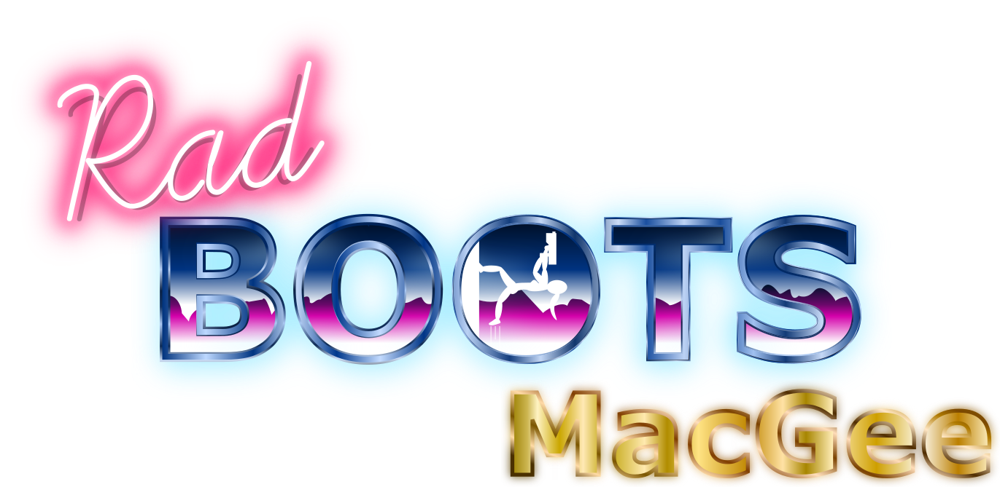

# Elevator Pitch?

A Synthwave inspired, first-person shooter with a multi-gravity mechanic - Walk, run, jump and shoot from the walls and ceiling! 

## Game Trailer

A 30-second trailer is available [here](https://youtu.be/7etaEZXMrqo).

## Deployment

Rad Boots MacGee is deployed and available to download to Windows on [Itch.io](https://waken-games.itch.io/radbootsmacgee).

## Game Jam

This game was created for a 1 week game jam as part of Games Jobs Live game parade.

## Installation Instructions

1. Head to the game page and download
2. Extract the zip file to anywhere of your choosing
3. Your computer's security settings may flag the .exe file as a security threat, however this is normal and the game is safe to run
4. Run the file and enjoy! 

## Technologies Used

- Unity
- C#
- Blender
- Inkscape

## Cite any Code Used:
Multi-gravity mechanic used from [aldonaletto](https://answers.unity.com/questions/155907/basic-movement-walking-on-walls.html), in answer to "Basic Movement. Walking on Walls." on the Unity community forum.